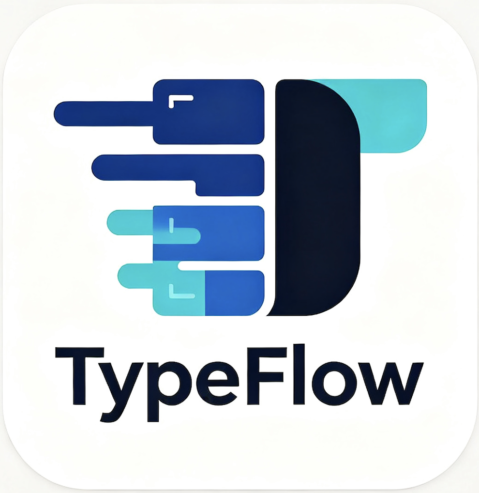

# TypeFlow (https://motiandalou.github.io/TypeFlow/)

A minimalist typing trainer designed for IELTS, TOEFL, academic writing, and daily English practice.

Built with React, TypeScript, Vite and Zustand.



## ✨ Features

### Practice Modes

- 📚 Built-in text library
- 📋 Paste custom text
- ⌨️ Real-time typing practice

### Typing Engine

- Character-by-character validation
- Correct characters highlighted in green
- Incorrect characters highlighted in red
- Multi-line text support

### Statistics

- WPM (Words Per Minute)
- Accuracy
- Progress Tracking
- Timer

### UI

- Clean minimalist design
- Black & White theme
- Responsive layout
- Rounded modern components

---

## 🚀 Tech Stack

### Frontend

- React 19
- TypeScript
- Vite

### State Management

- Zustand

### Routing

- React Router DOM

### Styling

- CSS
- Tailwind-ready structure

## ⚙️ Installation

Clone the repository:

```bash
git clone https://github.com/motiandalou/TypeFlow.git
```

Install dependencies:

```bash
npm install
```

Run development server:

```bash
npm run dev
```

Build production version:

```bash
npm run build
```

Preview production build:

```bash
npm run preview
```

---

## 📖 Usage

### Built-in Library

1. Open Home Page
2. Select a text from Library
3. Click Start
4. Begin typing

### Custom Text

1. Click Paste Text
2. Paste any English content
3. Click Start Typing
4. Practice immediately

---

## 📊 Current Metrics

TypeFlow currently supports:

- WPM
- Accuracy
- Progress
- Session Timer

---

## 🎯 You can do:

- IELTS Writing Practice
- TOEFL Writing Practice
- Academic English
- Business Email Training
- General Typing Improvement

---

## 🤝 Contributing

Contributions, issues, and feature requests are welcome.

Feel free to open an issue or submit a pull request.

---

## 📄 License

This project is licensed under the MIT License.

---

Built with ❤️ using React, TypeScript and Vite.
